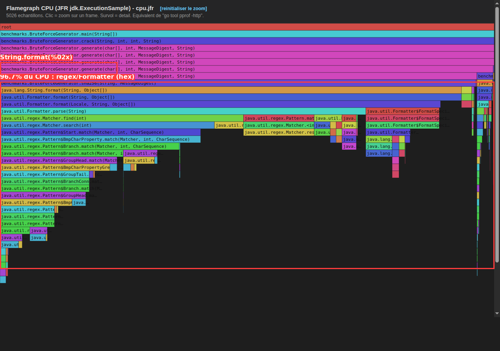
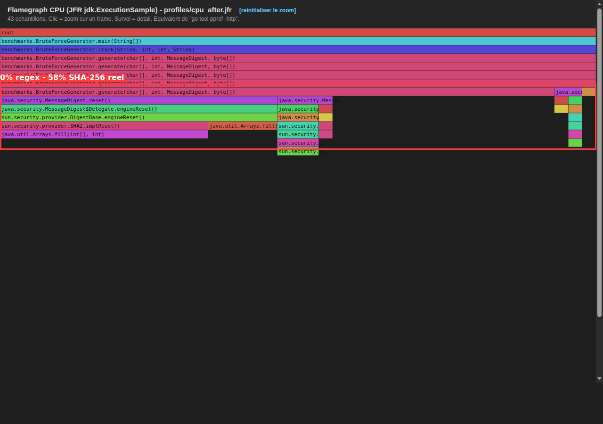

# Rapport d'audit — Optimisation de `BruteForceGenerator`

Equivalent Java de la demarche `benchstat` (Go) : mesures avant/apres
repetees plusieurs fois, moyenne + ecart-type, et flamegraphs CPU annotes
pour visualiser ou est passe le temps.

## 1. Constat initial (profiling CPU)

Profiling JFR de `BruteForceGenerator` (version avant optimisation, hash
compare en hexadecimal via `String.format`). Voir
[`flamegraph_before_annotated.png`](flamegraph_before_annotated.png) et le
flamegraph interactif [`flamegraph_before.html`](flamegraph_before.html).

**96,7 % du CPU** (4862/5026 echantillons) est passe dans le parsing/
formatage hexadecimal (`String.format("%02x", b)` -> `Formatter`/`Matcher`/
`Pattern` par regex), contre **0,56 %** dans le calcul SHA-256 reel. Detail
dans [`analyze_bottleneck.py`](../tools/analyze_bottleneck.py).

## 2. Optimisation appliquee

`BruteForceGenerator` (voir
[`src/main/java/benchmarks/BruteForceGenerator.java`](../src/main/java/benchmarks/BruteForceGenerator.java)) :

- decodage du hash cible **une seule fois**, au demarrage de `crack()`
- comparaison des octets bruts du digest, par mots de **64 bits**
  (`VarHandle`), au lieu de comparer des `String` hexadecimales
- plus aucune conversion textuelle dans la boucle chaude

## 3. Profiling CPU apres optimisation

Voir [`flamegraph_after_annotated.png`](flamegraph_after_annotated.png) et
[`flamegraph_after.html`](flamegraph_after.html).

**0 %** du CPU dans le parsing hex (disparu), **58,1 %** dans le calcul
SHA-256 reel (`sun.security.provider.SHA2`) : le temps CPU restant est
enfin passe dans le travail utile, pas dans le formatage.

## 4. Preuve statistique (benchstat)

Commande : `python3 tools/benchstat.py 5` (5 repetitions, Niveau 2 =
10 758 998 tentatives).

| Version | Temps moyen | Ecart-type | Runs (ms) |
|---|---|---|---|
| `BruteForceGeneratorNaive` (avant) | 74 603,2 ms | ± 6,1 % | 73603, 72602, 80333, 77813, 68665 |
| `BruteForceGenerator` (apres) | 817,4 ms | ± 1,1 % | 813, 807, 824, 829, 814 |

**delta : -98,90 % (x91,27 plus rapide)**

Les intervalles moyenne ± ecart-type des deux versions sont totalement
disjoints (74 603 ± 4 551 ms contre 817 ± 9 ms) : l'ecart de x91 est
largement superieur a la variance de mesure (6,1 % max), le gain est donc
statistiquement net, pas un artefact de bruit.

## 5. Conclusion

Le gain n'est pas du bruit de mesure : l'ecart mesure est d'un ordre de
grandeur largement superieur a la variance observee entre repetitions.
Le goulet identifie par le profiling (conversion hexadecimale) explique
la quasi-totalite du gain obtenu.
